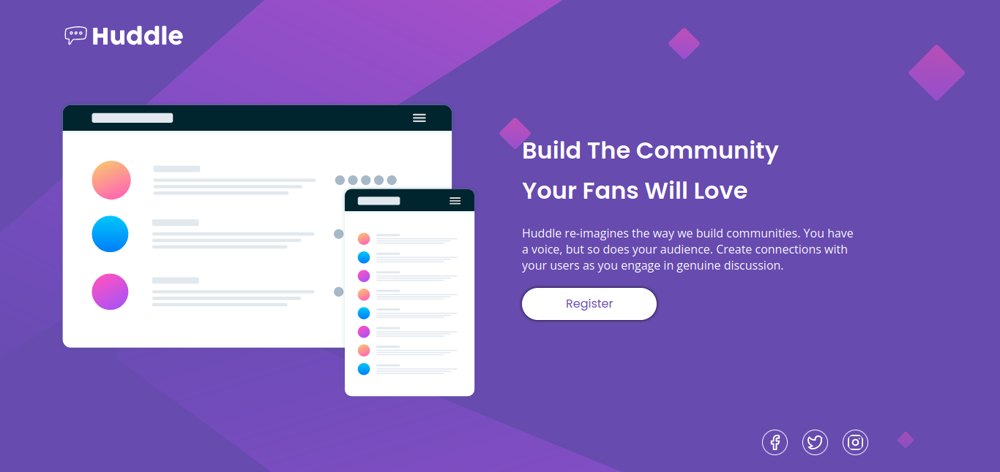

## Table of contents

- [Overview](#overview)
  - [The challenge](#the-challenge)
  - [Screenshot](#screenshot)
- [My process](#my-process)
  - [Built with](#built-with)
  - [What I learned](#what-i-learned)
  - [Continued development](#continued-development)

**Note: Delete this note and update the table of contents based on what sections you keep.**

## Overview

### The challenge

This challenge was easy after the background because I don't know how to use svg image so this is the more difficult part in this challenge.

### Screenshot

## My process

I started with the html although I feel it is the most difficult to read and easily one of the worst I have done. The CSS seems fine to me until you see the background, I don't know how to use SVG images so I had to figure out how to make the design and make everything visually acceptable.

### Built with

- Semantic HTML5 markup
- CSS custom properties
- Flexbox
- CSS Grid

### What I learned

I learn that svg image are very important in this design world.

### Continued development

I will continue to development my knowledge and skills about responsive design and grid-flexbox.